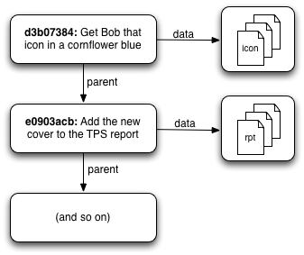

# Graphs and Git #

The reason I've gone on at some length about graph theory is that a Git repository is one giant graph.

Most of the time when you interact with Git, you're working with commits in one way or another. At the surface level, a Git commit consists of two things: (1) a pointer to the state of your code at some moment in time, and (2) zero or more pointers to "parent" commits.

_(Hint: the word "pointer" means you're probably talking about a graph.)_

**A Git commit is a node in a graph**, and each one of those nodes can point to other nodes that came before them.

> By the way: if you want to learn way more about this than any reasonable human should ever know, I highly recommend [Scott Chacon's "Git Internals" PDF](https://github.com/pluralsight/git-internals-pdf/releases). Scott's knowledge of Git is... impressive.
