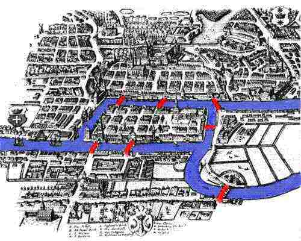

## Seven Bridges of Königsberg ##

Here's a drawing of the city of Königsberg, Prussia in the early 18th century.

The city was set on both sides of the Pregel River _(shown in blue)_, and included two large islands which were connected to each other and the mainland by seven bridges _(shown in red)_. Someone had posed the question of whether it was possible to walk through the city and **cross every bridge exactly once**.

In 1735, a mathematician named [Leonhard Euler](http://en.wikipedia.org/wiki/Leonhard_Euler) proved that such a route could not exist. In doing so, he basically invented a field of mathematics, which we now call graph theory.

_("Euler" is pronounced more or less like "oiler", by the way.)_
