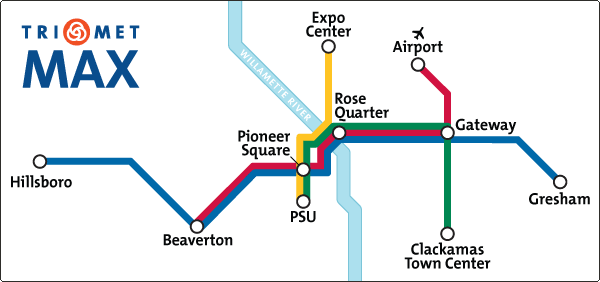

## Attaching Labels to Nodes ##

While mathematicians may be perfectly content to consider graphs only according to their shapes, most programmers and computer scientists tend to use them to compute some kind of meaningful results.

As such, it's often useful to label the nodes in a graph in some way. For example, here in lovely Portland, Oregon, **we love us some [public transit](http://trimet.org/)**. We've got [buses](http://trimet.org/bus/index.htm), [light rail](http://trimet.org/max/index.htm), [commuter rail](http://trimet.org/wes/index.htm), [streetcars](http://trimet.org/streetcar/index.htm), and even an [aerial tram](http://www.gobytram.org/).

Here's a quick overview of just our light rail system. This doesn't show all the stops—pardon me, _nodes_—it's just the transfer points and end stations for each line. The nodes have labels that make them mean something to humans, but as far as a computer is concerned, they could just be called "01100010".

...and if, right about now, you're starting to open your mouth and say, "hey, why are those lines different colors?" Then you, my friend, are on the right track. (No pun intended.)
