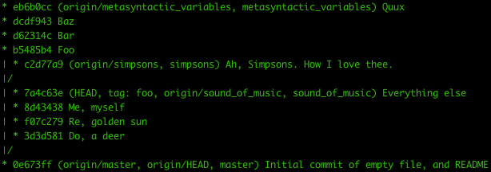

## Visualizing Your Git Repository ##

About half of my interactions with Git take place on the command line. But **when I want to understand what's going on, I use a visual Git tool**. I still use [GitX](https://rowanj.github.io/gitx/), but in the years since I first wrote this site, several other tools have been released. Use whatever works for you.

The main point of using a visualizer is to **help you make sense of your branch history**. For example, to list all commits in your repository at the command line, you could do `git log --oneline --abbrev-commit --all` — which will get you this flattened view:

***(Thanks to [\@cflipse](https://twitter.com/cflipse) for pointing out that `--pretty=oneline --branches=*` could be shortened to `--oneline --all`!)***


Or, you can add `--graph` to that command, which will show you a _slightly more useful_ view:

```
git log --oneline --abbrev-commit --all --graph
```


***(Thanks to [\@mjdominus](https://twitter.com/mjdominus) and [\@JRGarcia](https://twitter.com/JRGarcia) for reminding me about the `--graph` option!)***

If you want to see branch and tag labels, add `--decorate`:

```
git log --oneline --abbrev-commit --all --graph --decorate
```



***(Thanks again to [\@JRGarcia](https://twitter.com/JRGarcia) for the `--decorate` tip!)***

You can also add `--color` to pretty up the display a bit more (_sorry, no time to take a screenshot as I add this_):

```
git log --oneline --abbrev-commit --all --graph --decorate --color
```

And, in fact, I have a shell alias in my [dotfiles repository](https://github.com/geeksam/dotfiles/blob/master/bash/aliases) that does all of this:

```
alias gg='git log --oneline --abbrev-commit --all --graph --decorate --color'
```

Or, as an anonymous reader points out, you can set up a Git alias to do the same thing:

```
git config --global alias.graph "log --graph --oneline –decorate=short"
```

But mostly, I just use GitX, which shows all of the same information in a cleaner graphical view:


