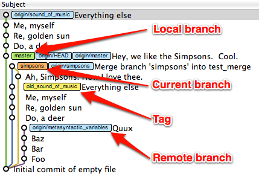

## Making Sense of the Display ##

Here's another look at that GitX screenshot, with a few annotations.

The important thing to know about this, though, isn't what you see here. It's what you **don't** see. Every Git tool I've ever seen shares one thing in common: **they hide commits from you**.

Sounds like a conspiracy theory, right? Not really.
