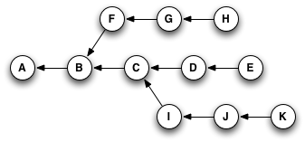
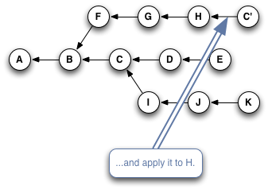

## Cherry-Picking Explained ##

Git's own online help has a perfectly accurate, if characteristically terse, description of what the command does:

> Given one or more existing commits, apply the change each one introduces, recording a new commit for each.

I've already mentioned (back on the page about [Garbage Collection](http://think-like-a-git.net/sections/graphs-and-git/garbage-collection.html)) that a Git commit's ID is a hash of both its contents and its history. So, even if you have two commits that introduce the exact same change, if they point to different parent commits, they'll have different IDs.

What `git cherry-pick` does, basically, is take a commit from somewhere else, and "play it back" wherever you are right now. Because this introduces the same change with a different parent, Git builds a new commit with a different ID.

Let's go back to this example from the [Reachability](http://think-like-a-git.net/sections/graph-theory/reachability.html) section:

If you were at node H in this graph, and you typed `git cherry-pick E` (_yes, you'd actually type part or all of the SHA for the commit, but for simplicity's sake, I'll just use the labels that are already here_), you'd wind up with a copy of commit E — let's call it "E prime" or **E'** — that pointed to H as its parent, like so:

Or, if you typed something like `git cherry-pick C D E`, you'd wind up with this when you were done:

The important thing to notice here is that Git has copied changes made in one place, and replayed them somewhere else.

Here's a quick slideshow that steps through the process:

