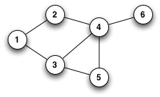
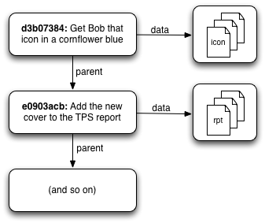
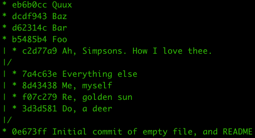
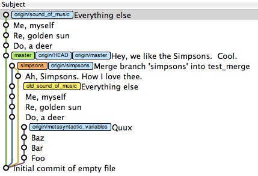
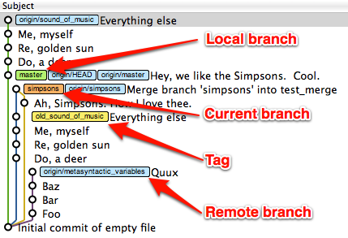

# Foreword {epub:type=prologue}

When you're just getting started, something as straightforward as a merge can be terrifying. It can take a long time to really become comfortable using some of Git's more advanced features. (It took me a year or two.)

Once people achieve some level of **Git enlightenment**, they tend to make statements of the form 'Git gets a lot easier once you realize X' - but that doesn't do much for people staring up Git's steep learning curve.

My goal with this site is to help you, Dear Reader, **understand what those smug bastards are talking about**.

# About this site #

This site is organized in a fairly linear fashion, ~~with two variants~~.

Each page has links at the bottom to the previous and next section, so you can read through the site from beginning to end. If you find that you're already familiar with some of the concepts in a given section, you can use the sidebar navigation to skip to specific pages.

***Keyboard junkies, you can also navigate between sections using the "N" and "P" keys, for (N)ext and (P)revious. Vim users may be pleased to know that "J" and "K" also work as they expect.***

(I used to have an "EPIC MODE" page that put almost all the content on one big long page, but I haven't been able to figure out how to replicate this using [Middleman](https://middlemanapp.com/). Feel free to contact me if you know how to do this.)

## Who This Site Is For ##

"Advanced beginners" with Git. You should know how to create a repository, add and commit files to it, and you should probably have some idea of why you might want to use a branch.

If you're still struggling with what version control software is for, this site may not be that useful to you. **I encourage you to poke around**, but if you're not getting much out of it, check out my [resources page](http://think-like-a-git.net/resources.html) for some pointers, and consider coming back to this site later.

On the other hand, if you can already do a `git rebase --interactive` without breaking a sweat, you may not get that much out of the site. (But I hope it gives you a framework for helping others learn!) I encourage you to look over the [Resources](http://think-like-a-git.net/resources.html), and suggest any other links you've found that have helped you get to where you are now.

## What This Site Will Try to Teach You ##

My goal is to give you **a simple strategy for safely experimenting** with some of the features that make Git so insanely, awesomely useful.

In order to do that, I need to make sure you know at least a little tiny bit about graph theory. ***Don't be intimidated by this!*** I hope you'll find, as I did, that graph theory just gives you a convenient place to hang a lot of concepts you're already familiar with.

Once I've introduced graph theory, I'll show you how it applies to Git, and I'll share my "Git epiphany" with you.

Finally, I'll explain the pattern I use to this day in working with Git repositories.

## Why This Site? ##

I've been using Git since sometime in 2008. I spent the first year or so flailing about and not really understanding what I was doing. At some point, I realized something that helped me get a lot more comfortable using Git. And, I started to formalize a pattern of interaction with Git that enabled me to increase my understanding and confidence in working with some of Git's more dangerous features.

I tried helping other people learn how to use Git, but I wasn't all that successful. A friend of mine later told me that I'd told him something along the lines of "all Git commands are really just graph manipulation commands", but that didn't actually help him at all at the time.

So, in April 2011, I tried to put together what I knew into an hour-long talk.

This began life as a "Lunch and Learn" presentation to my coworkers. Based on the positive feedback I got from that, I then gave the talk again at Portland BarCamp 2011 and Cascadia RubyConf 2011.

_(There's video of the Cascadia RubyConf talk on [Confreaks](http://confreaks.net/videos/612-cascadiaruby2011-think-like-a-git), but it's not very good—it was my first conference talk, and I delivered it with literally three minutes' warning.)_

Based on encouraging feedback from both of those talks, I wanted to turn the talk into a series of screencasts... but I thought writing it out would actually be a bit easier, and might be more accessible. (I like screencasts for some things, but I also find it hard to set time aside to watch them.) And here we are: as of June 2016, this site has had almost 400,000 unique visitors—which is approximately 399,990 more than I ever expected!

## About the Author ##

This site was created by Sam Livingston-Gray. I'm a software developer in Portland, Oregon. I can be reached at [geeksam@gmail.com](mailto:geeksam@gmail.com).

You'll find more information at [my resume website](http://resume.livingston-gray.com/), and at [GitHub](http://github.com/geeksam/), [LinkedIn](http://www.linkedin.com/pub/sam-livingston-gray/1/568/504), and [Twitter](https://twitter.com/geeksam/).

# Git Makes More Sense When You Understand X #

As I mentioned in [Why This Site?](http://think-like-a-git.net/sections/about-this-site/why-this-site.html), I once tried to help a friend learn Git by saying something that—he later told me—wasn't all that helpful. After getting that feedback, I started noticing this pattern:

**People tend to say things like "Git makes more sense when you understand [...]".**

So I did a quick Google search for that phrase in April 2011, and it turned up over **8 million results**. (Here, [try it yourself](http://www.google.com/search?q=git+makes+more+sense+when+you+understand).)

I've chosen a few examples of this pattern to talk about briefly.

## Example 1: Kent Beck ##

> "Finally figuring out that git commands are strangely named graph manipulation commands--creating/deleting nodes, moving pointers around."
>
> **-Kent Back**

**This is a perfect example of the form**. It sounds impressive, but unless you already know what the author is talking about, it doesn't really help.

I like this tweet for another reason. I've purchased and read several of Kent's books, and had assumed that he already knew everything there was to know. When I saw this, and realized that I'd understood something before him, I was quite surprised. And then I was amused at having been surprised.

## Example 2: Git for Ages 4 and Up ##

EXAMPLE 2: GIT FOR AGES 4 AND UP
In his talk "Git for Ages 4 And Up" (OSDC, 2010), Michael Schwern uses Tinker Toys to teach the audience how Git works.

Check out the very first sentence in the session description (_emphasis added_):

>**Git makes so much more sense when you understand how it really works**, because it's really a two trick pony.
> Tinker Toys are the best illustration of a Git repository I've found. Side-by-side with issuing Git commands, we'll build a Git repository out of kid's toys showing what's going on behind the scenes. Mind bending concepts like remote branching, rebase and the staging area become child's play.
> WARNING: CHOKING HAZARD - Small Parts. Not For Children Under 4 Years.

## Example 3: Homeomorphic Endofunctors ##

> "Git gets easier once you get the basic idea that branches are homeomorphic endofunctors mapping submanifolds of a Hilbert space".
>
> **-Chi Wai Lau**

**Don't worry. It's a joke.**

(At least, I'm pretty sure it's a joke. I don't actually have the math knowledge to know if this is actually a true statement.)

## Example 4: LSD and Chainsaws ##

This one isn't strictly of the same pattern, but I think it still captures the overall theme that Git is powerful and strange, and must be meditated upon to achieve enlightenment:

> And then there’s `git rebase --interactive`, which is a bit like
`git commit --amend` hopped up on acid and holding a chainsaw–completely insane and quite dangerous but capable of exposing entirely new states of mind."

-Ryan Tomayko, [The Thing About Git](http://tomayko.com/writings/the-thing-about-git), April 2008

## The Internet Talks Back! ##

> [think-like-a-git.net](http://think-like-a-git.net/) makes more sense when you realise that it's aimed at existing Git users, not complete beginners.
>
> **James McKay**

# Graph Theory #

**If you're already comfortable with graph theory, skip ahead to [Reachability](http://think-like-a-git.net/sections/graph-theory/reachability.html).]**

For a rather math-intensive introduction to graph theory, [see Wikipedia](http://en.wikipedia.org/wiki/Graph_theory). Here's a very short version of the definition they use there:

> A graph refers to a collection of nodes and a collection of edges that connect pairs of nodes.

Graph theory can be used to describe a lot of things, but I'll start off with one of the most straightforward examples: maps. You can think of graph theory as a way of encoding information about two aspects of a map: **places to go, and ways to get there**.

Let's start at the very beginning, shall we?

_[By the way: as important human inventions go, I happen to think graph theory is right up there alongside bacon and indoor plumbing. It takes some time to really sink in, though, so ***if you find your eyes glazing over in this section, don't worry about it.*** As long as the page about [reachability](http://think-like-a-git.net/sections/graph-theory/reachability.html) makes sense to you, you can come back and reread these pages later.]_

## Seven Bridges of Königsberg ##

Here's a drawing of the city of Königsberg, Prussia in the early 18th century.


The city was set on both sides of the Pregel River _(shown in blue)_, and included two large islands which were connected to each other and the mainland by seven bridges _(shown in red)_. Someone had posed the question of whether it was possible to walk through the city and **cross every bridge exactly once**.

In 1735, a mathematician named [Leonhard Euler](http://en.wikipedia.org/wiki/Leonhard_Euler) proved that such a route could not exist. In doing so, he basically invented a field of mathematics, which we now call graph theory.

_("Euler" is pronounced more or less like "oiler", by the way.)_

## Places To Go, and Ways to Get There ##

Here are two versions of the Königsberg map. On the left is a smaller version of the map you've already seen, and on the right is the version Euler used in his 1735 proof.


Here's what I think is so mind-bendingly cool about this: **Euler threw away all the information that didn't matter to the problem**.

If all you're concerned with is which bridges you cross, then for all intents and purposes, **each land mass can be represented by a point**, and **each bridge is just a line between two points**.

Which is why I say you can think of graph theory as the study of **places to go, and ways to get there**.


## Nodes and Edges ##

In the previous page, I said graph theory boils down to **places to go, and ways to get there**. Let's have another look at the definition I used earlier.

A graph refers to a collection of **nodes** and a collection of **edges** that connect pairs of nodes.

**Nodes**: Places to be
**Edges**: Ways to get there

In the Königsberg example, the land masses and islands are nodes, and the bridges are edges.


## Attaching Labels to Nodes ##

While mathematicians may be perfectly content to consider graphs only according to their shapes, most programmers and computer scientists tend to use them to compute some kind of meaningful results.

As such, it's often useful to label the nodes in a graph in some way. For example, here in lovely Portland, Oregon, **we love us some [public transit](http://trimet.org/)**. We've got [buses](http://trimet.org/bus/index.htm), [light rail](http://trimet.org/max/index.htm), [commuter rail](http://trimet.org/wes/index.htm), [streetcars](http://trimet.org/streetcar/index.htm), and even an [aerial tram](http://www.gobytram.org/).

Here's a quick overview of just our light rail system. This doesn't show all the stops—pardon me, _nodes_—it's just the transfer points and end stations for each line. The nodes have labels that make them mean something to humans, but as far as a computer is concerned, they could just be called "01100010".


...and if, right about now, you're starting to open your mouth and say, "hey, why are those lines different colors?" Then you, my friend, are on the right track. (No pun intended.)

## Attaching Labels to Edges ##

Just as we can label the nodes in a graph, we can also attach information to the edges. This might include:

- *Names* — for example, "12th Avenue".
- *Numbers (also called "weights")* — like distances or speeds.
- *Types* — to denote relationships, like "friend" or "coworker" or "parent of".
- *Direction* — in the previous example, relationships like "friend" and "coworker" are bidirectional, but "parent of" only goes one way _(unless, possibly, you're a character in a Robert A. Heinlein novel)_.


In fact, that last point about directionality is so important that it deserves its own page.

## Directed Versus Undirected Graphs ##

One of the key distinctions people make between graphs is whether they are directed or undirected. I'll admit, when I see the phrase "undirected graph," I sometimes get a mental image of a subway system map just sitting there aimlessly on the couch while its parents ask when it's going to take responsibility and do something with its life...



...but that's just me. Really, all we're saying is whether the edges in a graph are bidirectional or not.

Most, but not all, graphs I've seen have only one kind of edge. There are a few cases where you might want to use both—for example, a street map might have undirected edges for two-way streets and directed edges for one-way streets—but that's the only example I can think of off the top of my head.


## Reachability ##

**You can think of this graph as a set of three parallel universes** with time flowing from left to right, so that A is the beginning of recorded history. _(The arrow represents the "follows" or "is subsequent to" relationship, so you might say that "B follows A".)_


If you start from **E**, the history you'll see is **A**, **B**, **C**, **D**, **E**.

If you start from **H**, the history you'll see is **A**, **B**, **F**, **G**, **H**.

If you start from **K**, the history you'll see is **A**, **B**, **C**, **I**, **J**, **K**.

But the really important thing about this is that no matter which node you start with, **some parts of the graph will be unreachable to you**.

That sounds kind of pessimistic, so I'll turn it around: **Depending on where you start, you can reach parts of the graph that you couldn't get to otherwise**.

This may not sound like much, but stay with me for a little while longer—it's huge.

# Graphs and Git #

The reason I've gone on at some length about graph theory is that a Git repository is one giant graph.



Most of the time when you interact with Git, you're working with commits in one way or another. At the surface level, a Git commit consists of two things: (1) a pointer to the state of your code at some moment in time, and (2) zero or more pointers to "parent" commits.

_(Hint: the word "pointer" means you're probably talking about a graph.)_

**A Git commit is a node in a graph**, and each one of those nodes can point to other nodes that came before them.

> By the way: if you want to learn way more about this than any reasonable human should ever know, I highly recommend [Scott Chacon's "Git Internals" PDF](https://github.com/pluralsight/git-internals-pdf/releases). Scott's knowledge of Git is... impressive.

## Visualizing Your Git Repository ##

About half of my interactions with Git take place on the command line. But **when I want to understand what's going on, I use a visual Git tool**. I still use [GitX](https://rowanj.github.io/gitx/), but in the years since I first wrote this site, several other tools have been released. Use whatever works for you.

The main point of using a visualizer is to **help you make sense of your branch history**. For example, to list all commits in your repository at the command line, you could do `git log --oneline --abbrev-commit --all` — which will get you this flattened view:

***(Thanks to [\@cflipse](https://twitter.com/cflipse) for pointing out that `--pretty=oneline --branches=*` could be shortened to `--oneline --all`!)***


Or, you can add `--graph` to that command, which will show you a _slightly more useful_ view:

```
git log --oneline --abbrev-commit --all --graph
```



***(Thanks to [\@mjdominus](https://twitter.com/mjdominus) and [\@JRGarcia](https://twitter.com/JRGarcia) for reminding me about the `--graph` option!)***

If you want to see branch and tag labels, add `--decorate`:

```
git log --oneline --abbrev-commit --all --graph --decorate
```


***(Thanks again to [\@JRGarcia](https://twitter.com/JRGarcia) for the `--decorate` tip!)***

You can also add `--color` to pretty up the display a bit more (_sorry, no time to take a screenshot as I add this_):

```
git log --oneline --abbrev-commit --all --graph --decorate --color
```

And, in fact, I have a shell alias in my [dotfiles repository](https://github.com/geeksam/dotfiles/blob/master/bash/aliases) that does all of this:

```
alias gg='git log --oneline --abbrev-commit --all --graph --decorate --color'
```

Or, as an anonymous reader points out, you can set up a Git alias to do the same thing:

```
git config --global alias.graph "log --graph --oneline –decorate=short"
```

But mostly, I just use GitX, which shows all of the same information in a cleaner graphical view:



## References ##

You may have noticed the _very colorful_ labels in the GitX screenshot on the previous page. (If not, go back and have another peek. I'll wait.) Those labels are GitX's way of showing **references**.

I don't want to spend too much time talking about what each color means, because that particular representation is specific to GitX and you might be using something else. But however your visualizer represents them, you need to know what they are. (_Can I get a drumroll, please?_)

**References are pointers to commits.**

References come in several flavors: **local branch, remote branch**, and **tag**.

On disk, a ***local branch reference*** consists entirely of a file in your project's .git/refs/heads directory. This file contains the 40-byte identifier of the commit that the reference points to... and that's it. **The entire file is 40 bytes.**

You might have heard people talk about how Git allows "cheap branching." This is (part of) what they mean. Creating a branch in Git just means writing 40 bytes to disk, which is why `git branch foo` is so freaking fast.

What's **really** interesting about references, though, is how they behave. So, let's move on.

## The Reference Reference ##

As previously mentioned, there are a few different kinds of references, and they all point to commits in your repository. The only difference between them is how and when they move. (When I say that a reference moves, I mean that the ID of the commit that it points to is updated.)

**Local branch references** are specific to a single repository: your local one. Commands that affect local branch references include `commit`, `merge`, `rebase`, and `reset`.

**Remote branch references** are also specific to a single repository, but one that's previously been defined as a remote. Commands that affect remote branch references include `fetch` and `push`.

_(The `pull` command is a special case: it combines `fetch` and either a `merge` or a `rebase`, depending on how you've got Git configured.)_

**Tag references** are basically like branch references that never move. **Once you've created a tag, it will never change** (unless you explicitly update it using the `--force` option). This behavior makes them useful for marking specific versions of a software package, or marking exactly what got deployed to a production server on a particular date. As of this writing, I only know of one command that affects tags. As you might guess, it's `tag`.

## Making Sense of the Display ##

Here's another look at that GitX screenshot, with a few annotations.



The important thing to know about this, though, isn't what you see here. It's what you **don't** see. Every Git tool I've ever seen shares one thing in common: **they hide commits from you**.

Sounds like a conspiracy theory, right? Not really.

## Garbage Collection ##

Imagine this scenario: you write some code and check it in. Then, you realize you forgot to run the tests, so you run them, and they uncover a syntax error. Or you spot a typo. For whatever reason, you weren't done when you thought you were done.

Back when I used Subversion, the only thing to be done about this was to add the new change in another commit. Often, I'd wind up with three or four versions in my history. The first one would say "add feature X", and the next several would have messages like "oops, found typo" or "bugfix" or "forgot to run tests".

Git gives you another option: you can tack the new change on to the previous commit using `git commit --amend`. This keeps all of your related changes bundled together in one commit, so you can understand it more quickly when you're reviewing it later.

Here's another interesting fact about Git commits: a commit's ID is a [SHA-1 hash](http://en.wikipedia.org/wiki/SHA-1) of several pieces of information: the contents of the commit, **and the IDs of its parent commits**.

Which means that, when you use `git commit --amend`, you're actually building a completely different commit, and pointing your local branch reference to it instead. **The first commit you made is still there on disk, and you can still get back to it** (more on this later). However, in the interest of not cluttering up your view, neither `git log` nor your Git visualizer will show it to you, because it's not part of the history of something [Git thinks] you care about.

Eventually, Git will decide that it's time to run [garbage collection](http://en.wikipedia.org/wiki/Garbage_collection_(computer_science)#Reachability_of_an_object). (You can trigger this process yourself, using `git gc`.) Starting from every branch and every tag, Git walks back through the graph, building a list of every commit it can reach. Once it's reached the end of every path, it deletes all the commits it didn't visit.

# Experimenting With Git #

I said something really important on the previous page. It's so important I'll repeat it.

In describing Git's garbage collection algorithm, I said, "**Starting from every branch and every tag**, Git walks back through the graph, building a list of every commit it can reach." (_Emphasis added._)

Everything I've written up to this point has been to provide the background for you to **understand this one thing**. If I had ten seconds to tell you The Secret Of Git — _the entire point of this site_ — I can fit it into these four words:

**References make commits reachable.**

## References Make Commits Reachable ##

Let's unpack that sentence.

**References...**

...whether they are local branches, remote branches, or tags (see [here](http://think-like-a-git.net/sections/graphs-and-git/the-reference-reference.html))...

**...Make commits...**

...which are nodes in a graph (see [here](http://think-like-a-git.net/sections/graphs-and-git.html))...

**...reachable.**

...so that you can get back to them (see [here](http://think-like-a-git.net/sections/graph-theory/reachability.html)), and so that Git won't delete them when it decides it's time for spring cleaning (see [here](http://think-like-a-git.net/sections/graphs-and-git/garbage-collection.html)).

It took me a really long time to piece this together for myself. I'm writing this site so that you don't have to waste the time I did.

## My Humble Beginnings ##

When I first started using Git, I was really paranoid about losing code. The only VCS I'd used before that was Subversion, where branching is this arcane thing that causes all kinds of trouble. So I didn't have a lot of practice with merging -- let alone rebasing, which everyone said was really dangerous. (Remember [LSD and chainsaws?](http://think-like-a-git.net/sections/git-makes-more-sense-when-you-understand-x/example-4-lsd-and-chainsaws.html))

So, before I tried something I was a little uncertain about, **I would back up the entire directory**.

```
$ cd ..
$ cp -r work backup_work
$ cd work
```

Then I'd do the merge, or rebase, or whatever it was that I thought was tricky. If it looked like it worked, I'd continue on; if not, I'd delete the working directory, rename the old one, and try something else.

I don't have records, but I'm pretty sure **I did this for at least my first year of working with Git**.

When I finally realized that [references make commits reachable](http://think-like-a-git.net/sections/experimenting-with-git/references-make-commits-reachable.html), I (a) felt very dumb for all those times I backed up the repository, and (b) developed a much faster strategy for getting my repository back to a known state.

## Branches as Savepoints ##

Because a Git branch is just a 40-byte file on disk, **it takes orders of magnitude more time for you to tell the computer to create a branch** (by typing `git branch foo`) **than for your computer to actually do it**.

And because branches are references, and (_say it with me now_) [References Make Commits Reachable](http://think-like-a-git.net/sections/experimenting-with-git/references-make-commits-reachable.html), **creating a branch is a way to "nail down" part of the graph** that you might want to come back to later.

And because neither `git merge` nor `git rebase` will change your existing commits ([remember](http://think-like-a-git.net/sections/graphs-and-git/garbage-collection.html), a commit's ID is a hash of its contents **and its history**), you can create a temporary branch any time you want to try something you're even just a little bit unsure about.

In other words, **creating a branch before you try a merge or a rebase is like saving your game before you battle the boss**.

## Use Your Targeting Computer, Luke ##

I use GitX in almost every coding session. GitX behaves like a web browser in one very important way: **it won't immediately reflect changes to your repository** — you have to hit **Cmd+R** to tell it to (**R**)efresh its view. _(Since I first wrote this, later forks of GitX have added auto-refresh. I always turn it off.)_


You can use this to your advantage. Here's how: **when you've done something on the command line**, switch back to your visualizer, but **don't refresh right away**. Instead, try to predict how what you did will change its view. _(You can even try drawing out the graph on an index card.)_ Then, refresh the visualizer and ask yourself: **did it change in the way you expected**?

**If the answer is YES**: Congratulations! You just learned something!

**If the answer is NO**: Congratulations! You're about to learn something!

Repeat this process several thousand times, and eventually you won't need to refer to the visualizer as often. _(For those of you who like bad sci-fi movies, think of it as less "Use the force, Luke" and more_ ***"Usul no longer needs the weirding module.")***

# Testing Out Merges #

These days, I sling branches around without really thinking much about it. But the first few times I tried using different branches to develop features, it was a bit nerve-wracking. If that's where you are, what follows are two simple recipes that should help you play around with `git merge` until you understand exactly what it does.

I've put together two slight variations on the same operation. Both techniques basically do the same thing, but one of them relies on a slightly scarier-sounding Git command for the undo.

You might prefer one or the other based on how uncertain you are — about either your Git skills, or the specific merge you're about to try.

- Use the [Scout pattern](http://think-like-a-git.net/sections/testing-out-merges/the-scout-pattern.html) if you're still unclear on exactly what `git merge` does, or if you think it's likely that you'll decide to back out of the merge.
- Use the [Savepoint pattern](http://think-like-a-git.net/sections/testing-out-merges/the-savepoint-pattern.html) if you're pretty sure what you want to do, but just want to leave yourself an undo button in case things get too messy.

## The Scout Pattern ##

Here's a quick overview of the steps in this recipe:

1. Make sure you're on the right branch and that you have a clean working state.
2. Create a new branch (I often name it _test_merge_) and switch to it.
3. Do the merge.
4. Switch to your visualizer and predict how its view will change when you refresh it.
5. Refresh your visualizer and see whether your prediction was correct.
6. Are you happy with the result?
  - If YES: Move your real branch forward to where the _test_merge_ branch is.
  - If NO: Delete the _test_merge_ branch.

I call this the Scout pattern: you're unsure what the terrain ahead is like, so you send a scouting party ahead to check it out. If they radio back that everything's okay, you'll move ahead and join them. If not, well, it was just a small scouting party and we'll tell the families that they died with honor...

**THE LONG VERSION**

You're on the ***master*** branch and you want the changes from the ***spiffy_new_feature*** branch to be incorporated into ***master***. You're not sure if this will be a good idea, so you want to try out the merge, but be able to abort it if things don't go smoothly.

1. **Make sure you're on the right branch and that you have a clean working state.**  
  Whatever visualizer you're using, figure out how it shows you where your current branch is. Or, at the command line, type `git status` and you should see something like this:
```
# On branch master
nothing to commit (working directory clean)
```

2. **Create a new branch and switch to it.**  
  Type `git checkout -b test_merge`. Now, if you type `git status` again, you should see a message that you're on the ***test_merge*** branch.

3. Do the merge.  
  Type `git merge spiffy_new_feature`. If you're lucky, there won't be any merge conflicts you can't resolve.  
  **If you want to abort the merge** at this point, type `git reset --hard`.

4. **Switch to your visualizer and predict how its view will change when you refresh it.**  
  For example:  
    **a.** After a merge, you should see a new commit.  
    **b.** The new commit should have a message like "Merge branch 'spiffy_new_feature' into test_merge".  
    **c.** Your ***test_merge*** branch label should have moved to this new commit, while the ***master*** and ***spiffy_new_feature*** branch labels should still be in the same place.  

5. **Refresh your visualizer and see whether your prediction was correct.**

6. **Are you happy with the result?**  
  **If YES**: Move the _master_ branch forward to where the _test_merge_ branch is with:
```
git checkout master
git merge test_merge
```
  **If NO**: Drop the _test_merge_ branch with:
```
git checkout master
git branch -D test_merge
```

## The Savepoint Pattern ##

Here's a quick overview of the steps in this recipe:

1. Make sure you're on the right branch and that you have a clean working state.
2. Create a new branch to use as a savepoint, but don't switch to it.
3. Do the merge.
4. Switch to your visualizer and predict how its view will change when you refresh it.
5. Refresh your visualizer and see whether your prediction was correct.
6. Are you happy with the result?
  If YES: Delete the savepoint.
  If NO: Reset your branch to the savepoint.
(Unless the last video game you ever played was Super Mario Brothers, it should be obvious why I call this one the Savepoint pattern.)

**THE LONG VERSION**

You're on the ***master*** branch and you want the changes from the ***spiffy_new_feature*** branch to be incorporated into ***master***. You're reasonably confident that you'll want to keep the changes, but you want to be able to abort it if, for example, this feature has unintended side effects.

1. **Make sure you're on the right branch and that you have a clean working state.**

2. Whatever visualizer you're using, figure out how it shows you where your current branch is. Or, at the command line, type `git status` and you should see something like this:
```
# On branch master
nothing to commit (working directory clean)
```
3. **Create a new branch to use as a savepoint, but don't switch to it.**  
Type `git branch savepoint`. Now, if you type `git status` again, you should still see a message that you're on the ***master*** branch.

4. **Do the merge.**  
  Type `git merge spiffy_new_feature`. If you're lucky, there won't be any merge conflicts you can't resolve.  
  **If you want to abort the merge** at this point, just type `git reset --hard`.

5. **Switch to your visualizer and predict how its view will change when you refresh it.**  
  For example:  
  **a.** After a merge, you should see a new commit.  
  **b.** The new commit should have a message like "Merge branch 'spiffy_new_feature' into master".  
  **c.** Your ***master*** branch label should have moved to this new commit, while the ***spiffy_new_feature*** branch label should still be in the same place.  

6. **Refresh your visualizer and see whether your prediction was correct.**

7. Are you happy with the result?  
  **If YES**: Delete the savepoint.
```
git branch -d savepoint
```
  **If NO**: Reset your branch to the savepoint.
```
git reset --hard savepoint
```

If you want to clean up, you can now delete the savepoint with `git branch -d savepoint`.

## Black Belt Merging ##

Once you're comfortable with the Savepoint pattern, you might get tired of creating the savepoint branch, only to have to remember to delete it every time. If so, I have good news for you: you don't actually need to use a branch as a savepoint for merges.

Merge commits always wind up with a branch label pointing at them, and one of the branch's parent commits will be the commit that that branch label was just moved from.

It may take you a few tries to parse that sentence. The upshot is that the commit you started on — the one you would've marked with a savepoint branch — **will always be reachable**.

Here's the thing: **Git doesn't care what you call your branches**. Remember, branches are just a 40-byte file on disk that points to the commit's SHA-1 hash, which is what Git really uses for all of its work. The branch is just there for us puny humans to have some convenient, memorable name pointing to part of the graph.

At the end of [the Savepoint pattern](http://think-like-a-git.net/sections/testing-out-merges/the-savepoint-pattern.html), the command you type to reset your branch to the savepoint is `git reset --hard` savepoint (where "savepoint" is a branch name). If you look at the documentation that comes up when you type `git reset -h`, you'll see that the final argument it takes is called `<commit>`. Older versions of the documentation called this `<commit-ish>`, which was a convenient reminder that you could use anything that Git can turn into a SHA-1 hash.

Things Git is happy to accept in a `<commit>` argument include (but are probably not limited to):
- Branch names
- Tags
- Relative references like **HEAD\^**, **HEAD\^\^**, or **HEAD~3**
- partial SHA-1 hashes like 8d434382 (you just have to provide enough initial digits to be unique; Git will fill in the rest for you)
- SHA-1 hashes like 8d434382d9420940be260199a8a058cf468d9037 (these are _very easy_ for Git to turn into SHA-1 hashes!)

So, at the end of [the Savepoint pattern](http://think-like-a-git.net/sections/testing-out-merges/the-savepoint-pattern.html), if you wanted to back out of the merge, you could just as easily use `git log` or your visualizer to find the SHA-1 of the commit (let's say it starts with 1234abcd), and type this:

```
git reset --hard 1234abcd
```

...and **Git would behave exactly the same** as if you'd remembered to create a branch in the first place.

> That bit about "if you'd remembered to" reminds me: one of the single most helpful bits of commentary I ever read about Git was Ryan Tomayko's [The Thing About Git](http://tomayko.com/writings/the-thing-about-git). (Yes, that's the same thing I linked to in [LSD and Chainsaws](http://think-like-a-git.net/sections/git-makes-more-sense-when-you-understand-x/example-4-lsd-and-chainsaws.html).)

# Rebase From the Ground Up #

Git's `rebase` command was one of those things that it took me forever to figure out. This was partly because I just had a lot to learn about managing branches in general, but it was also partly because it seemed like the only time people bothered to write about rebase was to say [how incredibly weird and dangerous it was](http://think-like-a-git.net/sections/git-makes-more-sense-when-you-understand-x/example-4-lsd-and-chainsaws.html).

This is a damn shame, because **rebase is the single most useful command I use in Git**. More importantly, **it's actually pretty easy to understand once you get the hang of it**.

**DANGER, WILL ROBINSON!**

I've tried to demystify rebase in this section, and I do plan to write up a strategy for experimenting with rebase, just as I have with merge. However, I recently realized that I forgot to mention something very important about rebase: **it is generally considered rude to rewrite history in public!**

Before you start using rebase in a shared repository, make sure everyone who works on your project is comfortable working with rebase. You might also consider changing everyone's default pull strategy to "rebase" instead of "merge".

**END OF PUBLIC SERVICE ANNOUNCEMENT.**

With that said, I'm going to take a brief digression, because I think it's much easier to explain rebase in the context of another Git command: `git cherry-pick`.

## Cherry-Picking Explained ##

Git's own online help has a perfectly accurate, if characteristically terse, description of what the command does:

> Given one or more existing commits, apply the change each one introduces, recording a new commit for each.

I've already mentioned (back on the page about [Garbage Collection](http://think-like-a-git.net/sections/graphs-and-git/garbage-collection.html)) that a Git commit's ID is a hash of both its contents and its history. So, even if you have two commits that introduce the exact same change, if they point to different parent commits, they'll have different IDs.

What `git cherry-pick` does, basically, is take a commit from somewhere else, and "play it back" wherever you are right now. Because this introduces the same change with a different parent, Git builds a new commit with a different ID.

Let's go back to this example from the [Reachability](http://think-like-a-git.net/sections/graph-theory/reachability.html) section:


If you were at node H in this graph, and you typed `git cherry-pick E` (_yes, you'd actually type part or all of the SHA for the commit, but for simplicity's sake, I'll just use the labels that are already here_), you'd wind up with a copy of commit E — let's call it "E prime" or **E'** — that pointed to H as its parent, like so:


Or, if you typed something like `git cherry-pick C D E`, you'd wind up with this when you were done:


The important thing to notice here is that Git has copied changes made in one place, and replayed them somewhere else.

Here's a quick slideshow that steps through the process:


## Using 'git cherry-pick' to Simulate 'git rebase' ##

Once you have `git cherry-pick` down, you can start off by thinking of `git rebase` as being a faster way to cherry-pick all of the commits in a given branch at once, rather than having to type out their IDs separately.

_(That's only the very beginning of what rebase can do, but I'll write the rest of this section another time.)_

Let's go back to our trusty example, but this time add some branches...


Now, I could type this sequence of commands:

```
git checkout foo
git checkout -b newbar
git cherry-pick C D E
```

In order, these commands:
- make sure we're at **H** (because 'foo' points to it),
- create **and check out** a temporary branch called "newbar", also pointing at **H**,
- apply the changes from **C**, **D**, and **E**, creating new commits **C'**, **D'**, and **E'**, and update the "newbar" branch so it points at **E'**.

Which would give me a repository that looked like this:


Then, I could type this:

```
git checkout bar
git reset --hard newbar
git branch -d newbar
```

Which would:
- Switch to the branch called "bar",
- Forcibly move the "bar" branch pointer so that it pointed to the same place as the "newbar" branch (and, thanks to the --hard flag, update my working directory to match the new location), and
- Delete the temporary "newbar" branch.

And leave my repository looking like this _(note that the original_ ***D*** _and_ ***E*** _nodes are no longer reachable, because no branch points to them):_


**Or**, I could have accomplished all that by typing this instead:

```
git rebase foo bar
```

In other words, 'git rebase' (in this form) is a shortcut that lets you pick up entire sections of a repository and move them somewhere else.

## A Helpful Mnemonic for 'git rebase' Arguments ##

To summarize the previous section, this:

```
git checkout foo
git checkout -b newbar
git cherry-pick C D E
git checkout bar
git reset --hard newbar
git branch -d newbar
```

is equivalent to this:

```
git rebase foo bar
```

When you do a rebase, you are ***rewriting history***. You are, in effect, saying to Git, "Hey, you know those things that happened over there on that completely different timeline? I want you to pretend that they happened here instead."

The documentation for the rebase command lists a lot of different ways you can invoke it. Frankly, I'm still not sure what some of them do, and I have a hard time parsing out the different parentheses and brackets to figure out exactly how you'd use, for example, `--onto`.

Here's how I think of it: in English, we read **from left to right**. On most charts that show the change in something over time, time is shown on the x-axis of the graph, with time increasing from left to right. When you issue commands to the shell, you can put several of them on one line, and they'll be executed in order **from left to right**.

So when I use `git rebase`, I (_almost_) always give it two arguments: the name of the place I want to start from, and the name of the place I want to end up. Or, to put it another way, I tell rebase the sequence of events I want it to create, **from left to right**: `git rebase first_this then_this`

# The End #

> Where do we go from here?
> Where do we go from here?
> The battle's done, and we kind of won
> So we sound our victory cheer
> Where do we go from here?
>
>**-Buffy the Vampire Slayer, "Once More, With Feeling"**

Technically, this isn't the end—this is just all I've written so far. I hope you've enjoyed reading this, and I really hope I've been able to help you learn something.

**I welcome your feedback!** Feel free to drop me an [email](mailto:geeksam@gmail.com) or a [tweet](https://twitter.com/#!/geeksam) and let me know what you think.

Happy hacking!
-Sam
